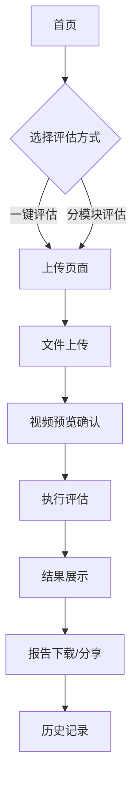

## 1. 产品概述
视频导出评估站点是一个专业的视频质量分析平台，帮助视频创作者和后期制作人员评估导出视频的各项指标。通过VMAF、PSNR、SSIM等专业指标评估画质，测试导出速度，分析码率变化，为用户提供全面的视频导出质量评估报告。

目标用户：视频创作者、后期制作人员、视频平台运营者。产品价值在于提供专业的视频质量评估工具，帮助用户优化视频导出参数，提升视频质量。

## 2. 核心功能

### 2.1 用户角色
| 角色 | 注册方式 | 核心权限 |
|------|----------|----------|
| 普通用户 | 邮箱注册 | 基础评估功能、查看历史记录 |
| 高级用户 | 邀请码升级 | 高级评估参数设置、批量处理、详细报告导出 |

### 2.2 功能模块
产品包含以下主要页面：
1. **首页评估页面**：一键评估主按钮、三个评估模块卡片、结果展示区
2. **上传页面**：视频文件上传、格式检测、预览功能
3. **历史记录页面**：评估历史查看、结果对比、报告管理

### 2.3 页面详情
| 页面名称 | 模块名称 | 功能描述 |
|----------|----------|----------|
| 首页评估页面 | 一键评估 | 快速启动完整评估流程，同时执行画质、速度、码率三项评估 |
| 首页评估页面 | 画质评估模块 | 提供VMAF、PSNR、SSIM三个子评估项，支持独立选择和执行，显示详细计算结果和可视化图表 |
| 首页评估页面 | 导出速度评估模块 | 基准设置面板配置测试参数，时间输入组件支持手动输入或自动记录，历史数据对比功能，性能趋势图表展示 |
| 首页评估页面 | 码率分析模块 | 并列显示原视频和导出视频码率数值，可视化码率对比图表，自动计算并显示最终评分 |
| 首页评估页面 | 结果展示区 | 综合评估结果面板，汇总各模块评分计算最终得分，提供详细评估报告下载功能，支持结果分享和导出 |
| 上传页面 | 文件上传 | 支持拖拽上传和点击上传，检测视频格式和编码信息，显示上传进度 |
| 上传页面 | 视频预览 | 上传完成后提供视频预览功能，显示基础视频信息（分辨率、时长、码率等） |
| 历史记录页面 | 历史记录列表 | 展示所有评估历史记录，支持按时间、评分等条件筛选 |
| 历史记录页面 | 结果对比 | 选择多个评估结果进行对比分析，生成对比报告 |

## 3. 核心流程
用户操作流程：
1. 用户访问首页，可以选择"一键评估"快速开始，或选择特定评估模块
2. 上传原视频和导出视频文件，系统自动检测视频信息
3. 选择评估模块（画质、速度、码率），设置相关参数
4. 执行评估，实时查看进度和中间结果
5. 查看综合评估结果，下载详细报告或分享结果

## 4. 用户界面设计

### 4.1 设计风格
- **主色调**：深蓝色（#1890ff）作为主色，浅灰色（#f5f5f5）作为背景
- **按钮样式**：圆角矩形，悬停动效，主要操作为实心主色按钮
- **字体规范**：主标题18-24px，正文14px，小标题16px，使用系统默认字体栈
- **布局风格**：卡片式布局，顶部导航栏，内容区域采用网格系统
- **图标风格**：使用Ant Design图标库，线性风格，统一尺寸

### 4.2 页面设计概览
| 页面名称 | 模块名称 | UI元素 |
|----------|----------|--------|
| 首页评估页面 | 一键评估按钮 | 顶部居中显示，蓝色主按钮，大小为48px高度，包含播放图标 |
| 首页评估页面 | 评估模块卡片 | 三列网格布局，每个卡片包含标题、描述、操作按钮，卡片高度统一为320px |
| 首页评估页面 | 结果展示区 | 底部全宽面板，包含评分圆环、详细数据表格、操作按钮组 |
| 上传页面 | 上传区域 | 中央拖拽区域，虚线边框，上传图标和提示文字，支持多文件上传 |
| 历史记录页面 | 记录列表 | 表格形式展示，包含缩略图、文件名、评估时间、评分等信息 |

### 4.3 响应式设计
- **桌面优先**：基础设计为1920x1080分辨率，支持更大屏幕
- **平板适配**：768px-1024px屏幕，采用两列布局，调整卡片尺寸
- **手机适配**：小于768px屏幕，采用单列布局，隐藏非核心元素
- **触摸优化**：按钮最小点击区域为44x44px，支持手势操作

### 4.4 交互动效
- **页面切换**：淡入淡出效果，时长300ms
- **按钮反馈**：点击缩放效果（0.95倍），悬停阴影加深
- **加载状态**：骨架屏加载，旋转加载图标
- **图表动画**：数字滚动效果，图表绘制动画
- **结果展示**：渐进式显示，重要数据优先展示