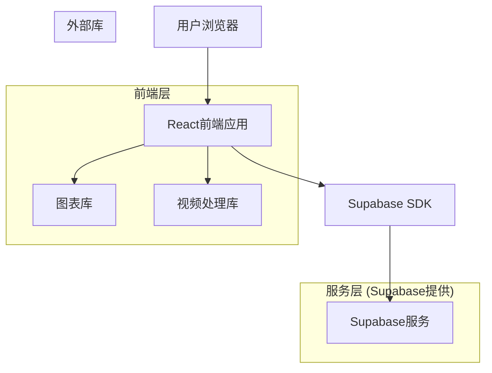
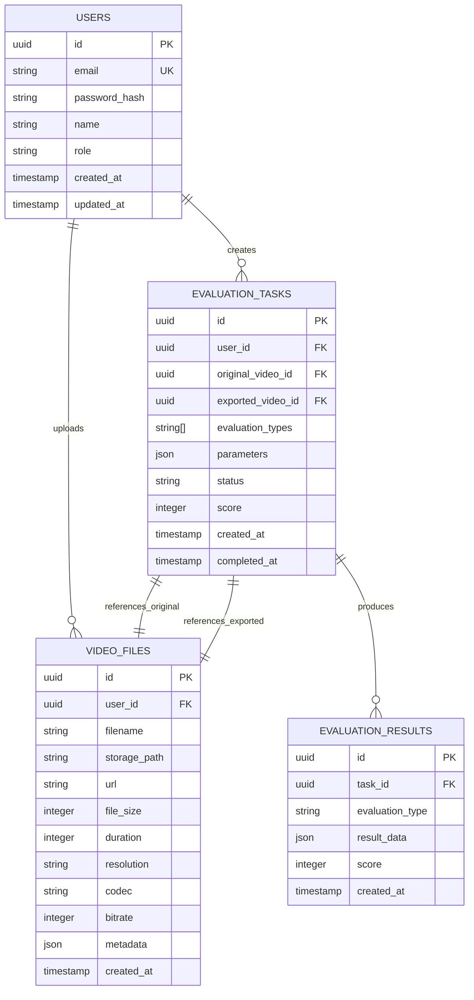

## 1. 架构设计



## 2. 技术描述

- **前端框架**: React@18 + TypeScript@5 + Vite@5
- **初始化工具**: vite-init
- **UI组件库**: Ant Design@5 + Tailwind CSS@3
- **图表库**: Chart.js@4 + react-chartjs-2
- **视频处理**: ffmpeg.wasm@0.12
- **状态管理**: React Context + Zustand@4
- **后端服务**: Supabase (提供认证、数据库、存储)
- **测试框架**: Vitest@1 + React Testing Library@14
- **代码质量**: ESLint@8 + Prettier@3 + Husky@8

## 3. 路由定义

| 路由 | 用途 |
|------|------|
| / | 首页评估页面，包含一键评估和三个评估模块 |
| /upload | 视频上传页面，支持拖拽上传和预览 |
| /history | 历史记录页面，查看和管理评估历史 |
| /result/:id | 评估结果详情页面，展示详细报告 |
| /login | 用户登录页面 |
| /register | 用户注册页面 |
| /profile | 用户个人中心 |

## 4. API定义

### 4.1 核心API

#### 视频上传相关
```
POST /api/videos/upload
```

请求参数：
| 参数名 | 参数类型 | 是否必需 | 描述 |
|--------|----------|----------|------|
| file | File | 是 | 视频文件 |
| type | string | 是 | 视频类型（original/exported） |

响应：
| 参数名 | 参数类型 | 描述 |
|--------|----------|------|
| id | string | 视频文件ID |
| url | string | 视频访问URL |
| metadata | object | 视频元数据信息 |

#### 评估任务创建
```
POST /api/evaluation/create
```

请求参数：
| 参数名 | 参数类型 | 是否必需 | 描述 |
|--------|----------|----------|------|
| originalVideoId | string | 是 | 原视频ID |
| exportedVideoId | string | 是 | 导出视频ID |
| evaluationTypes | string[] | 是 | 评估类型数组 |
| parameters | object | 否 | 评估参数设置 |

响应：
| 参数名 | 参数类型 | 描述 |
|--------|----------|------|
| taskId | string | 评估任务ID |
| status | string | 任务状态 |
| estimatedTime | number | 预估完成时间（秒） |

#### 评估结果获取
```
GET /api/evaluation/result/:taskId
```

响应：
| 参数名 | 参数类型 | 描述 |
|--------|----------|------|
| taskId | string | 任务ID |
| status | string | 任务状态 |
| results | object | 评估结果数据 |
| score | number | 综合评分 |
| createdAt | string | 创建时间 |

### 4.2 TypeScript类型定义

```typescript
// 视频文件接口
interface VideoFile {
  id: string;
  url: string;
  name: string;
  size: number;
  duration: number;
  resolution: string;
  codec: string;
  bitrate: number;
  uploadTime: string;
}

// 评估任务接口
interface EvaluationTask {
  id: string;
  originalVideo: VideoFile;
  exportedVideo: VideoFile;
  types: EvaluationType[];
  status: 'pending' | 'processing' | 'completed' | 'failed';
  parameters: EvaluationParameters;
  results?: EvaluationResults;
  score?: number;
  createdAt: string;
  completedAt?: string;
}

// 评估类型枚举
enum EvaluationType {
  VMAF = 'vmaf',
  PSNR = 'psnr',
  SSIM = 'ssim',
  SPEED = 'speed',
  BITRATE = 'bitrate'
}

// 评估参数接口
interface EvaluationParameters {
  vmaf?: {
    model: string;
    subsample: number;
  };
  ssim?: {
    windowSize: number;
    gaussianWeight: number;
  };
  speed?: {
    benchmark: string;
    iterations: number;
  };
}

// 评估结果接口
interface EvaluationResults {
  vmaf?: {
    score: number;
    histogram: number[];
    frameScores: number[];
  };
  psnr?: {
    avg: number;
    min: number;
    max: number;
    frameScores: number[];
  };
  ssim?: {
    score: number;
    frameScores: number[];
  };
  speed?: {
    exportTime: number;
    benchmark: string;
    history: SpeedHistory[];
  };
  bitrate?: {
    original: number;
    exported: number;
    ratio: number;
    score: number;
  };
}
```

## 5. 数据模型

### 5.1 数据模型定义



### 5.2 数据定义语言

用户表（users）
```sql
-- 创建表
CREATE TABLE users (
  id UUID PRIMARY KEY DEFAULT gen_random_uuid(),
  email VARCHAR(255) UNIQUE NOT NULL,
  password_hash VARCHAR(255) NOT NULL,
  name VARCHAR(100) NOT NULL,
  role VARCHAR(20) DEFAULT 'user' CHECK (role IN ('user', 'premium', 'admin')),
  created_at TIMESTAMP WITH TIME ZONE DEFAULT NOW(),
  updated_at TIMESTAMP WITH TIME ZONE DEFAULT NOW()
);

-- 创建索引
CREATE INDEX idx_users_email ON users(email);
CREATE INDEX idx_users_role ON users(role);
```

视频文件表（video_files）
```sql
-- 创建表
CREATE TABLE video_files (
  id UUID PRIMARY KEY DEFAULT gen_random_uuid(),
  user_id UUID NOT NULL REFERENCES users(id) ON DELETE CASCADE,
  filename VARCHAR(255) NOT NULL,
  storage_path VARCHAR(500) NOT NULL,
  url VARCHAR(500) NOT NULL,
  file_size BIGINT NOT NULL,
  duration INTEGER NOT NULL,
  resolution VARCHAR(20) NOT NULL,
  codec VARCHAR(50) NOT NULL,
  bitrate INTEGER NOT NULL,
  metadata JSONB DEFAULT '{}',
  created_at TIMESTAMP WITH TIME ZONE DEFAULT NOW()
);

-- 创建索引
CREATE INDEX idx_video_files_user_id ON video_files(user_id);
CREATE INDEX idx_video_files_created_at ON video_files(created_at DESC);
```

评估任务表（evaluation_tasks）
```sql
-- 创建表
CREATE TABLE evaluation_tasks (
  id UUID PRIMARY KEY DEFAULT gen_random_uuid(),
  user_id UUID NOT NULL REFERENCES users(id) ON DELETE CASCADE,
  original_video_id UUID NOT NULL REFERENCES video_files(id) ON DELETE CASCADE,
  exported_video_id UUID NOT NULL REFERENCES video_files(id) ON DELETE CASCADE,
  evaluation_types TEXT[] NOT NULL,
  parameters JSONB DEFAULT '{}',
  status VARCHAR(20) DEFAULT 'pending' CHECK (status IN ('pending', 'processing', 'completed', 'failed')),
  score INTEGER,
  created_at TIMESTAMP WITH TIME ZONE DEFAULT NOW(),
  completed_at TIMESTAMP WITH TIME ZONE
);

-- 创建索引
CREATE INDEX idx_evaluation_tasks_user_id ON evaluation_tasks(user_id);
CREATE INDEX idx_evaluation_tasks_status ON evaluation_tasks(status);
CREATE INDEX idx_evaluation_tasks_created_at ON evaluation_tasks(created_at DESC);
```

评估结果表（evaluation_results）
```sql
-- 创建表
CREATE TABLE evaluation_results (
  id UUID PRIMARY KEY DEFAULT gen_random_uuid(),
  task_id UUID NOT NULL REFERENCES evaluation_tasks(id) ON DELETE CASCADE,
  evaluation_type VARCHAR(20) NOT NULL CHECK (evaluation_type IN ('vmaf', 'psnr', 'ssim', 'speed', 'bitrate')),
  result_data JSONB NOT NULL,
  score INTEGER,
  created_at TIMESTAMP WITH TIME ZONE DEFAULT NOW()
);

-- 创建索引
CREATE INDEX idx_evaluation_results_task_id ON evaluation_results(task_id);
CREATE INDEX idx_evaluation_results_type ON evaluation_results(evaluation_type);
```

### 5.3 Supabase访问权限设置

```sql
-- 匿名用户权限（基础读取权限）
GRANT SELECT ON users TO anon;
GRANT SELECT ON video_files TO anon;
GRANT SELECT ON evaluation_tasks TO anon;
GRANT SELECT ON evaluation_results TO anon;

-- 认证用户权限（完整访问权限）
GRANT ALL PRIVILEGES ON users TO authenticated;
GRANT ALL PRIVILEGES ON video_files TO authenticated;
GRANT ALL PRIVILEGES ON evaluation_tasks TO authenticated;
GRANT ALL PRIVILEGES ON evaluation_results TO authenticated;

-- RLS策略示例（基于用户ID的行级安全）
ALTER TABLE video_files ENABLE ROW LEVEL SECURITY;
CREATE POLICY "用户只能访问自己的视频文件" ON video_files
  FOR ALL TO authenticated
  USING (auth.uid() = user_id);

ALTER TABLE evaluation_tasks ENABLE ROW LEVEL SECURITY;
CREATE POLICY "用户只能访问自己的评估任务" ON evaluation_tasks
  FOR ALL TO authenticated
  USING (auth.uid() = user_id);
```

## 6. 性能优化策略

### 6.1 前端性能优化
- **代码分割**：按路由和组件进行代码分割，实现懒加载
- **图片优化**：使用WebP格式，实现响应式图片加载
- **缓存策略**：利用浏览器缓存和Service Worker缓存静态资源
- **虚拟滚动**：在长列表场景下使用虚拟滚动技术
- **防抖节流**：在搜索、输入等场景应用防抖节流

### 6.2 视频处理优化
- **Web Worker**：将视频处理任务放到Web Worker中执行
- **分片处理**：大视频文件采用分片处理策略
- **进度反馈**：实时显示处理进度，提升用户体验
- **错误重试**：实现自动重试机制，处理网络异常

### 6.3 监控和分析
- **性能监控**：使用Web Vitals监控核心性能指标
- **错误监控**：集成Sentry进行错误收集和分析
- **用户行为**：使用Google Analytics追踪用户行为
- **日志记录**：记录关键操作日志，便于问题排查